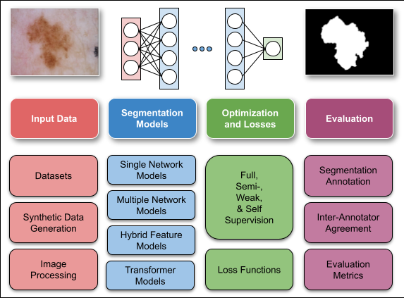

# A Survey on Deep Learning for Skin Lesion Segmentation

This repository contains links to the interactive and downloadable versions of the table of papers from our comprehensive survey of the literature spanning 177 research papers on deep learning-based segmentation of skin lesions from 2014 to 2022.

**A Survey on Deep Learning for Skin Lesion Segmentation**, _Medical Image Analysis_, 2023. [[DOI]](https://doi.org/10.1016/j.media.2023.102863) [[arXiv]](https://arxiv.org/abs/2206.00356) [[PDF]](https://www.cs.sfu.ca/~hamarneh/ecopy/media2023.pdf)

- [Interactive HTML table](https://www.sfu.ca/~kabhishe/skin-lesion-segmentation/)

- [Interactive and downloadable Google Sheets table](http://i.sfu.ca/uzZqAj)



If you find this survey useful, please cite it as:

```
@article{mirikharaji2023survey,
  doi = {10.1016/j.media.2023.102863},
  url = {https://doi.org/10.1016/j.media.2023.102863},
  title={A Survey on Deep Learning for Skin Lesion Segmentation},
  author={Mirikharaji, Zahra and Abhishek, Kumar and Bissoto, Alceu and Barata, Catarina and Avila, Sandra and Valle, Eduardo and Celebi, M Emre and Hamarneh, Ghassan},
  journal = {Medical Image Analysis},
  year={2023},
  month = jun,
  publisher = {Elsevier {BV}},
  pages = {102863},
}
```
